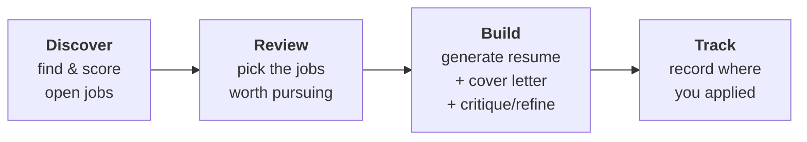

# 4. Running the System

[← Configuration](03-configuration.md) · [Next: Architecture →](05-architecture.md)

---

Once installed and configured, here's how you use Maestro day to day.

## Starting and stopping

You generally keep three things running: **Docker (n8n)**, the **dashboard**, and optionally the **scheduler**.

### Start everything

```bash
# 1. Backend (from the backend folder)
docker compose -p maestro-ai up -d

# 2. Dashboard (from the dashboard folder)
npm run dev

# 3. Scheduler — optional (from the dashboard folder)
docker compose -p maestro-ai up -d scheduler
```

Then open the dashboard at **http://localhost:4400**.

### Stop everything

```bash
# Stop the dashboard: press Ctrl+C in its terminal

# Stop the backend + scheduler (from the backend / dashboard folder)
docker compose -p maestro-ai down
```

Your data is safe across restarts — it lives in your Google Sheet and a named Docker volume.

> ⚠️ Remember the **`-p maestro-ai`** flag on every `docker compose` command, or Docker will start a separate, empty project.

---

## The everyday workflow

A typical cycle has four stages: **Discover → Review → Build → Track**.



### 1. Discover jobs

**Automatically:** if the scheduler is running, discovery fires on your `job_search_cron` cadence.

**Manually:** open the dashboard's **Discovery** page and use the run button, or run **Job Discovery** in n8n with **Execute Workflow**.

Discovery pulls jobs from your watchlist companies (via Greenhouse, Lever, Ashby, and JSearch sources), ranks them with a fast first pass (Agent 10), then scores the survivors for fit (Agent 8). Results land in the `jobs` tab and appear on the Discovery page.

### 2. Review

On the **Discovery** page you'll see each job with:

- **Target fit** and **Background fit** verdicts (the two scoring axes)
- The score rationale, strengths, and gaps
- Where it came from and when it was discovered

Decide which jobs are worth an application. You can **dismiss** ones you don't want (they're hidden but recoverable) and **flag for build** the ones you do.

> 💡 A job can be dismissed *or* flagged for build, never both — the dashboard enforces this so your pipeline stays clean.

### 3. Build an application

Select one or more flagged jobs and click **Build**. The dashboard calls the **Application Orchestrator**, which for each job runs:

1. **Agent 1** drafts a tailored resume.
2. **Agent 5** critiques it like a recruiter.
3. **Agent 6** refines it to address the critique (if `enable_refinement` is on).
4. **Agent 3** verifies no facts were invented.
5. **Agent 2** drafts a cover letter; **Agent 4** verifies it (if `enable_cover_letter` is on).
6. **Agent 7** scores the final resume's fit.

The results — the resume, the critic's notes, the verifier's checks, and the score — are recorded to the `resumes` and `agent_outputs` tabs, and the files are saved to a per-job folder in Drive.

This costs roughly **\$0.06–\$0.12** per job in API usage with the default models.

### 4. Review and refine the resume

Open the application in the dashboard to read the generated resume, the critic's feedback, and the verifier's findings. If you want changes, type **refinement instructions** and submit. This calls **Application Refinement**:

- The **first** refinement is a "polish" — it re-works version 1 using the original critique and verification.
- **Later** refinements ("refine") build on the previous version.

Each refinement creates a new resume version (`v2`, `v3`, …) so you never lose earlier drafts.

When you're happy, use **Save to Drive** to generate a clean `.docx` of that version into the job's folder.

### 5. Track your applications

The **Tracking** page lists every job and its application status. Update the status as you progress:

`not reviewed → applied → screening → interviewing → final round → offer / rejected / withdrew / ghosted`

You can also record notes, the date you applied, and your next action.

---

## Submitting your own jobs

Found a job Maestro didn't discover? You can feed it in directly from the dashboard's **Submit** page (`/submit`). A user-submitted job skips discovery scoring (you've already decided it's worth it) and goes straight into the build pipeline via the same **Application Orchestrator**.

The Submit page has two modes:

- **Single Job** — a form with company, title, URL, and the job description. All four are required.
- **Bulk Import** — upload a CSV or XLSX file with multiple jobs (parsed in your browser). Validation is all-or-nothing: if any row is malformed, nothing is written and you get per-row errors to fix.

Submitted jobs are tagged `source = user`, marked ready to build, and the build fires immediately. **User-submitted jobs have priority** over discovery-sourced ones and aren't subject to the discovery batch pacing cap, so they build right away.

If you submit the same job URL twice, Maestro deduplicates: an already-built job returns a "already built" notice (unless you choose to reprocess), and a job currently building returns "already in flight." A failed or never-built duplicate is superseded in place.

> ℹ️ You can still add jobs by hand if you prefer — add a row to the `jobs` tab with `source = user`, fill `url`, `company`, `title`, `description_html`, and flag it for build.

---

## Keeping an eye on cost

Every AI call is logged in the **`model_usage`** tab with its agent, provider, model, token counts, and dollar cost. The dashboard's analytics view summarizes this. Because there are no silent model fallbacks, what you see is exactly what you chose to spend.

To control cost:

- Use cheaper models for high-volume agents (drafting, verifying, discovery).
- Lower `discovery_max_jobs_per_run` so fewer jobs get fully scored.
- Turn off cover letters (`enable_cover_letter = FALSE`) if you don't need them.

---

## Running discovery on a schedule

The scheduler reads `job_search_cron` and `timezone` from your `config` tab and re-checks them every ~10 minutes, so you can change your schedule in the Sheet without restarting anything.

- Change `job_search_cron` to adjust cadence (e.g. `0 7 * * 1-5` for 7 AM on weekdays).
- The scheduler guards against overlapping runs.
- The dashboard shows a banner telling you whether discovery is currently running or when it last ran.

---

[← Configuration](03-configuration.md) · [Next: Architecture →](05-architecture.md)
