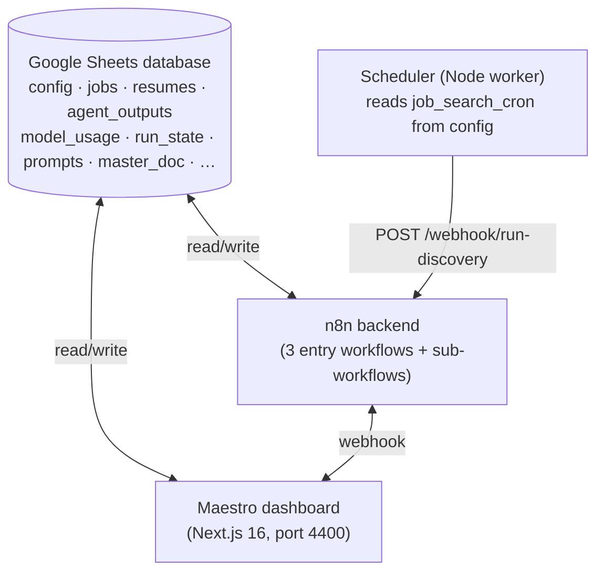
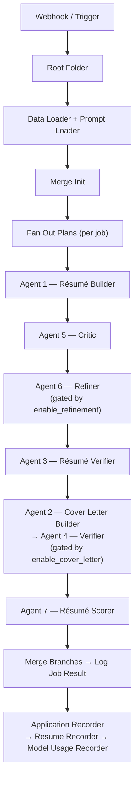
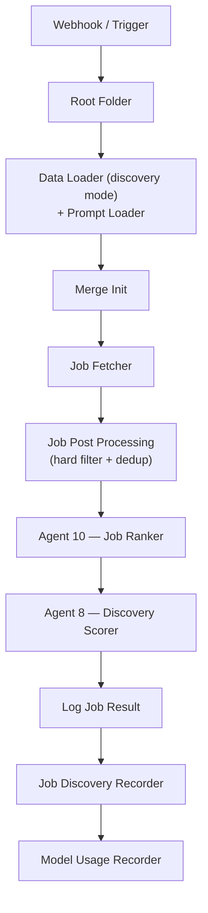
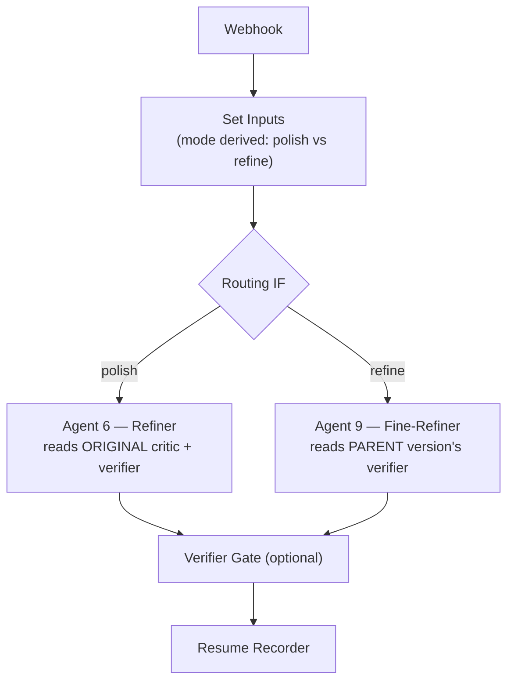
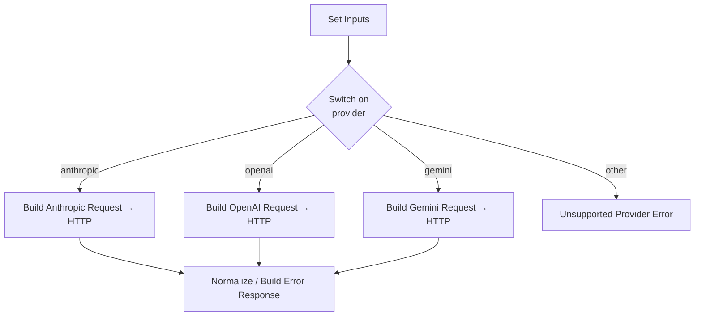

# 5. Architecture

[← Running the System](04-running.md) · [Next: Database Reference →](06-database-reference.md)

---

This page is for developers who want to understand, modify, or contribute to Maestro. It describes the workflow topology, the agent roster, the shared modules, the keying scheme, and the design decisions worth knowing before you change anything.

## High-level shape



The dashboard frontend code lives in a **separate repository** and is not part of the backend repo. The backend repo holds the n8n workflow exports, the database template, and the scheduler.

## Entry workflows and webhooks

Three workflows are entry points. Each has both a manual trigger (for testing in n8n) and a webhook. **Every webhook call carries an `X-Maestro-Secret` header** matching `MAESTRO_WEBHOOK_SECRET`; a missing/wrong secret is rejected. All three are POSTed by `postToN8n()` in the dashboard's `src/lib/n8n.ts` with `Content-Type: application/json`.

| Workflow | Webhook path | Fired by | Request body | Success response |
|----------|-------------|----------|--------------|------------------|
| **Application Orchestrator** | `/webhook/build-application` | dashboard build/submit routes | `{ "job_ids": ["job_xxx", ...] }` — the entire payload | `202 { ok, accepted, run_id, job_count, job_ids }` |
| **Job Discovery** | `/webhook/run-discovery` | **scheduler worker only** | `{ "source": "cron" }` | `202` with `run_id` (`disc_…`) in body |
| **Application Refinement** | `/webhook/refine-resume` | dashboard `/api/refine` | refine payload (see below) | `202 { ok, accepted, run_id }`; dashboard polls `resumes` |
| **Cover Letter Generation & Refinement** | `/webhook/generate-cover-letter` | dashboard `/api/cover-letters` | generate/refine payload | `202` with `run_id` (`cl_…`) in body |

> 📌 **Discovery is not triggered by the Next.js app in-process.** The dashboard has no internal timer for it — discovery is fired exclusively by the standalone **scheduler** container (a manual "run now" still routes through that path, not an app-side timer). This is intentional: a request/response server has no reliable persistent timer.

**Build selection contract:** the Application Orchestrator is told which jobs to build via the `{ job_ids: [...] }` payload and **nothing else** — n8n filters by that list and ignores every other column. The dashboard's `processed_status='queued'` marker is purely a local UI/pacing device for *building* that payload, never the wire selector. Build is fired by `fireNextBatch()` (`src/lib/build-trigger.ts`); user-submitted rows fire whole and are exempt from the `application_max_jobs_per_run` pacing cap.

**Build trigger responses (`/api/application/trigger`):** `503` (webhook URL/secret unconfigured) · `200 { held: true, queued, processing }` (a run is still in flight) · `200 { accepted: false, job_count: 0 }` (nothing pending) · `202 { accepted: true, run_id, job_count, job_ids }` (fired).

**Refine payload (`/api/refine`, a validated pass-through):** common keys `mode` (`'polish'|'refine'`), `application_run_id`, `parent_resume_id`, `parent_resume_markdown`, `refinement_instructions`, `run_verifier`, `job_id`, `url`, `company`, `title`, `jd_text`, `parent_version`, `parent_score`. *Polish* adds `critic_output` + `verifier_output` (parsed objects from the original run). *Refine* adds `parent_ran_verifier`, plus `verifier_output` only when `parent_ran_verifier === true`. Validation returns `400` on missing required keys or mode/data-gap mismatches, `503` if the webhook URL is unconfigured, `502` if upstream accepts but returns no `run_id`.

## The agent roster

All agents are n8n sub-workflows invoked via Execute Workflow nodes. They share a uniform contract and route LLM calls through **Call LLM**.

| # | Agent | Stage | Role |
|---|-------|-------|------|
| 1 | Résumé Builder | application | Draft résumé from master_doc + JD |
| 2 | Cover Letter Builder | application | Draft cover letter |
| 3 | Résumé Verifier | application | Anti-hallucination check on résumé |
| 4 | Cover Letter Verifier | application | Anti-hallucination check on cover letter |
| 5 | Critic | application | Recruiter-style critique of the résumé |
| 6 | Résumé Refiner | application | Rewrite résumé to address critique (gated by `enable_refinement`) |
| 7 | Résumé Scorer | application | 0–100 fit score with dimensional breakdown |
| 8 | Discovery Scorer | discovery | Dual-axis fit scoring of discovered jobs |
| 9 | Résumé Fine-Refiner | refinement | Apply user refinement instructions on later passes |
| 10 | Job Ranker | discovery | Cheap first-pass ranking to keep the funnel open |

Agents 5, 6, and 7 are intentionally **decoupled from company/title/url** — they work purely from the JD, the master document, and upstream artifacts. That uniformity lets discovery-sourced and user-submitted jobs flow through the same pipeline.

## Pipeline topology

### Application pipeline



### Discovery pipeline



### Refinement pipeline



The **mode is derived, not chosen**: if a job has exactly one résumé version, the next refinement is a *polish* (re-works v1 using the original critique). If it already has refinements, it's a *refine* (builds on the immediate parent).

## Shared modules

### Call LLM (the provider abstraction)

Every agent calls **Call LLM** rather than hitting a provider directly. It normalizes three providers behind one interface:



All three return one standard envelope:

```json
{
  "success": true,
  "content": "...",
  "input_tokens": 0,
  "output_tokens": 0,
  "cached_input_tokens": 0,
  "cache_write_tokens": 0,
  "model_used": "...",
  "provider_used": "...",
  "errors": []
}
```

Provider quirks handled inside Normalize:

- **Anthropic** — returns the model string as passed. Cache via `cache_control`: cache-read ≈ 10% of input price, cache-write ≈ 125%.
- **OpenAI** — `prompt_tokens` *includes* the cached portion, so Normalize subtracts it to keep `input_tokens` non-cached. No separate cache-write fee. Auto-caches prompts ≥1024 tokens. Pricing lookups prefer the config-canonical model name over the dated API variant.
- **Gemini** — model is in the URL path; system prompt goes in `systemInstruction`. `promptTokenCount` includes cached tokens (subtracted in Normalize). Auth via `x-goog-api-key`.

Every provider HTTP node has `On Error: Continue (using error output)` with retry-on-fail, feeding a provider-specific Build Error Response.

### Data Loader

Loads config, master_doc, pricing, and watchlist from the Sheet, and **generates the `run_id`**: the caller passes `parent_execution_id = {{ $execution.id }}`, and Data Loader prefixes it (`app_` for application, `disc_` for discovery, `refine_` for refinement). It throws if `parent_execution_id` is missing — that's a caller bug, not something to paper over.

### Recorders

Five recorder sub-workflows persist results. **All of them take a passed `database_id`** rather than hardcoding a sheet — this lets you point at mock, test, or production databases by swapping one input.

| Recorder | Writes to |
|----------|-----------|
| Model Usage Recorder | `model_usage` |
| Resume Recorder | `resumes` + `agent_outputs` |
| Application Recorder | delegates résumé recording to Resume Recorder |
| Job Discovery Recorder | `jobs` (discovery rows) |
| Run State Recorder | `run_state` |

### Run Error Handler

A dedicated Error Trigger workflow that captures catastrophic failures into the `run_errors` tab (with execution URL for debugging). It hardcodes the `database_id` because the error payload doesn't carry one — and because it must not depend on the very Data Loader that may have failed.

## Keying scheme

Three identifiers, each with a distinct job:

| Key | Format | Purpose |
|-----|--------|---------|
| `application_run_id` | `app_<execution.id>` | **Cross-tab join key.** `jobs`, `resumes`, `agent_outputs` all key on it. |
| `run_id` | `app_` / `disc_` / `refine_` + `execution.id` | Per-execution trace (rides along in logs/usage). |
| `resume_id` | `{job_id}_v{version}` | Discriminates résumé versions (v1 original, v2+ refinements). |

> 📌 Don't rename `application_run_id` to `run_id`. They're different things — the first joins tabs, the second traces an execution.

## The two scoring axes

Discovery scoring (Agent 8) produces **two independent scores per job**:

- **Target fit** — answers *"does this match the role being searched for?"* Reads only the `target_*` config fields.
- **Background fit** — answers *"does this match the candidate's actual experience?"* Reads `profile_summary`, `background_titles`, and the master doc.

The agent's prompt enforces **input isolation**: target sub-scores may consult only the target inputs, background sub-scores only the background inputs. One exception — `location_match` must be equal across both axes. Config fields are authoritative over softer signals in the profile summary if they conflict.

This separation exists because, for an over-qualified candidate deliberately targeting a more junior role, collapsing the two would stamp every legitimate target match as "no fit" due to background bleed.

## Pipeline state model (three orthogonal axes)

Job state is tracked on three independent axes. They are **not** to be consolidated — a job can legitimately be, say, `queued` *and* `hide` at once.

| Axis | Column / tab | Values | Owner |
|------|-------------|--------|-------|
| Build lifecycle | `processed_status` (jobs) | `'' \| queued \| processing \| done \| error` | UI writes `queued`/`processing` for pacing; n8n writes `done`/`error` terminals |
| Discovery triage | `job_status` (jobs) | `'' \| hide` | dashboard dismiss/un-dismiss only |
| Run lifecycle | `run_state` tab | `running \| completed \| idle` | Run State Recorder |

`done` means a build **succeeded** — it is not a "user-skipped" marker. `job_status` is deliberately narrow and must never carry queue state.

## The scheduler

A standalone Node worker (`scripts/discovery-scheduler.ts`, run via `npm run scheduler` → `tsx`) in its own container (`Dockerfile.scheduler`, `node:20-alpine`). It:

- Loads env via `dotenv` from `.env.local` then `.env`; values already set (e.g. from `docker-compose`) win and are not overwritten.
- Reads `job_search_cron` + `timezone` from the `config` tab via the same `readSheet` the dashboard uses (no duplicated logic). Requires `GOOGLE_SHEETS_CLIENT_EMAIL`, `GOOGLE_SHEETS_PRIVATE_KEY`, `GOOGLE_SHEETS_DATABASE_ID`.
- Validates the cron expression; an invalid value keeps the previous schedule rather than crashing. A missing `job_search_cron` means no task is scheduled.
- Re-reads config every `CONFIG_REFRESH_MS` (default `600000` = 10 min) and reschedules only if the cron or timezone changed.
- On each tick, checks the run state and skips if a discovery run is already in flight (a read failure logs and fires anyway — n8n dedup catches duplicates). Then POSTs `{ source: 'cron' }` to `${N8N_WEBHOOK_BASE_URL}/run-discovery` with the `X-Maestro-Secret` header.
- **Requires `MAESTRO_WEBHOOK_SECRET`.** If it's unset, the tick logs *"webhook secret not configured; skipping tick"* and does not fire.
- Exits cleanly on `SIGINT` / `SIGTERM`.

**Why external?** n8n's Schedule Trigger config is static — it can't read a cron expression *out of* the sheet (the read happens after the trigger fires). The worker is also migration-friendly: its only coupling to n8n is the URL from `runDiscoveryUrl()`; when n8n is eventually retired, only that target changes.

## Migration intent

n8n was chosen as a fast demo substrate. The long-term plan is to migrate the orchestration into the Next.js app. The architecture anticipates this: the scheduler, run-state model, and webhook contracts are app-side and stable; retiring n8n changes only the webhook target URLs.

## n8n pitfalls (read before editing workflows)

Hard-won lessons. Ignore at your peril:

1. **Literal `=` prefix bug.** Typed Workflow Inputs crossing Execute Workflow boundaries can get an erroneous leading `=`. Sub-workflows use a `stripEquals` helper to clean inputs.
2. **Typed object fields.** Trigger schema fields like `config`, `critique`, `verifier` **must be typed `Object`, not `String`** — String typing makes n8n JSON-stringify them on receipt, silently breaking `config.model_X` lookups.
3. **Expression syntax differs by node.** `={{ }}` vs `{{ }}` behaves differently between HTTP nodes and Sheets nodes; mixing them causes `#NAME?` formula errors.
4. **No manual leading `=`** in expression-mode fields.
5. **Publish sub-workflows.** Saving isn't enough — unpublished sub-workflows aren't callable.
6. **Refresh schema cache** (⟳ on the Execute Workflow node) after changing a sub-workflow's trigger schema.
7. **One match column** for Sheet upserts — n8n only handles a single match column cleanly. The `run_state` tab uses a composite `state_key`.
8. **`max_tokens` truncation.** If a JSON parse fails and `output_tokens` equals the configured max, the response was cut off — raise the cap.
9. **Parse defensively.** LLMs sometimes append commentary after JSON; strip fences and extract the first `{` to last `}`.
10. **Run Once for Each Item** on multi-company parse nodes (Greenhouse/Ashby), not the default all-items mode.

## Google Drive / Docs pitfalls

- `@page` CSS margins are **ignored** on HTML→Google-Doc import; margins require an Apps Script post-process step.
- HTML→Google-Doc conversion strips formatting — the dashboard's résumé export uses the `docx` npm library to emit real `.docx` instead.
- Apps Script needs explicit OAuth scopes in `appsscript.json`, a `testAuth` run before deploy, and a **"New version"** selection on redeploy (or it serves cached code).

---

[← Running the System](04-running.md) · [Next: Database Reference →](06-database-reference.md)
