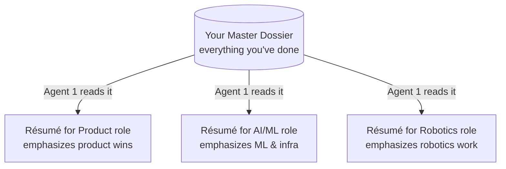

# 10. Your Master Career Dossier

[← Prompting & Customizing](09-prompting.md) · [Next: Importing Workflows →](11-importing-workflows.md)

---

The **master career dossier** is the single most important thing you provide to Maestro. Every resume and cover letter is built *entirely* from it — the agents are forbidden from inventing anything not present here. Get this right and everything downstream gets better.

This page explains what the dossier is, how to structure it, and the principles that make it work well.

## What it is — and why it matters

Think of the dossier as your **"everything" resume**: a complete, honest record of your career that's far longer than any single resume would be. For each job application, the Résumé Builder reads the job description, then *selects and emphasizes* the relevant parts of your dossier — it never adds anything that isn't there.



*Same source of truth → different emphasis per job. Nothing invented.*

**The golden rule:** if a fact, metric, or credential isn't in your dossier, it can't appear on any resume. So the dossier should be **comprehensive** (everything relevant you've ever done) and **truthful** (every claim something you'd stand behind in an interview).

## Where it lives

The dossier is stored in the `master_doc` tab of your database as a single markdown document (the `markdown` row). You normally edit it through the dashboard's **Master Doc** page rather than the Sheet directly.

| `master_doc` key | What it holds |
|------------------|---------------|
| `markdown` | **The dossier itself** — one markdown document |
| `updated_at` | When you last changed it |
| `source_filename` | The file you imported it from (optional) |

---

## How to structure it

The dossier is plain **markdown** — headings with `#`, bullets with `-`. Use this structure as your template:

```markdown
# [Your Name] — [Your professional identity / target level]

[A 2–3 sentence professional summary: years of experience, core domains,
and the kind of impact you're known for.]

## Experience

### [Title] — [Company] ([Start]–[End or "present"])
- [Accomplishment with scope and a quantified result.]
- [Accomplishment with scope and a quantified result.]
- [Accomplishment with scope and a quantified result.]

### [Earlier Title] — [Company] ([Start]–[End])
- [Accomplishment …]
- [Accomplishment …]

## Education
- [Degree, field — Institution]
- [Degree, field — Institution]

## Skills
[Comma-separated list of genuine skills, domains, and tools.]
```

### A worked example

Here's a complete, well-formed dossier (a sanitized sample — yours will be longer):

```markdown
# Jordan — VP / Director, AI & Product

Seasoned AI and product leader with 12+ years building and scaling machine
learning products across robotics, autonomous systems, and AI infrastructure.
Track record of leading cross-functional teams from research through production.

## Experience

### VP of Product, Robotics Platform — Acme Robotics (2021–present)
- Led product strategy for a humanoid manipulation platform, growing from
  prototype to 14 enterprise deployments.
- Built and managed a 22-person product + ML team across perception,
  planning, and control.
- Drove $18M in new ARR through enterprise partnerships with manufacturing
  and logistics customers.

### Director of AI/ML — Vega Autonomy (2017–2021)
- Owned the ML roadmap for autonomous vehicle perception, shipping 3 major
  model generations.
- Reduced false-positive obstacle detection by 41% through a redesigned
  sensor-fusion pipeline.
- Scaled the data labeling and training infrastructure to process
  2.5M frames/day.

### Senior Product Manager, AI Infrastructure — Helix Compute (2014–2017)
- Launched a managed model-serving platform adopted by 60+ internal teams.
- Defined the GPU scheduling and cost-attribution system that cut inference
  spend 30%.

## Education
- M.S. Computer Science, Robotics — Carnegie Mellon University
- B.S. Electrical Engineering — UC Berkeley

## Skills
AI/ML product strategy, robotics, computer vision, autonomous systems, team
leadership, enterprise GTM, model infrastructure, cross-functional execution.
```

Notice what makes this work: every bullet has **scope** (team size, deployment count) and a **quantified result** (`$18M ARR`, `41%`, `2.5M frames/day`). Those numbers are what the Builder pulls in to make a resume concrete — and what the Verifier checks against.

---

## What to put in each section

### The headline (`#`)

One line: your name, an em-dash, and your professional identity or target level. This anchors how the agents read everything below it.

> ✅ `# Jordan — VP / Director, AI & Product`
> ❌ `# Jordan's Resume`

### The summary (the paragraph under the headline)

Two or three sentences covering **years of experience, core domains, and signature impact**. The Builder uses this to write each resume's professional summary, tailored to the role. Keep it factual — it's a description, not a sales pitch.

### Experience (the heart of the dossier)

This is where most of the value lives. For **each role**:

- **A `###` heading** with your title, company, and dates. Use honest dates exactly as they were — the Verifier trusts these and won't "correct" them.
- **Accomplishment bullets**, not duty lists. Each should ideally have three parts:

```
[Action verb] + [what you did, with scope] + [quantified result]

"Reduced false-positive obstacle detection by 41% through a redesigned
 sensor-fusion pipeline."
 └─ result ──────────────────────┘ └─ what & how ──────────────────┘
```

**Be exhaustive here.** Include accomplishments across *all* the directions you might apply in. If you sometimes target product roles and sometimes ML roles, document both kinds of wins. The Builder will pick the right ones per job — but only from what you've given it.

### Education

Degrees, fields, and institutions. Add certifications, postdocs, or fellowships as extra bullets if relevant.

### Skills

A genuine, comma-separated list of skills, domains, and tools you've actually used. The Verifier will flag any skill on a resume that isn't supported here — so this list defines what's "allowed" to appear.

---

## Principles for a strong dossier

### 1. Comprehensiveness beats brevity

A regular resume is short because it's tailored to one role. The dossier is the *opposite* — it should be long and complete, a superset of every resume Maestro could ever build. Missing accomplishments can never make it onto a resume.

### 2. Quantify everything you honestly can

Numbers are the raw material of strong bullets. `$18M ARR`, `22-person team`, `60+ internal teams`, `30% cost reduction` — these are what turn a generic claim into a credible one. If you have a real number, include it. The agents will only use figures that are actually present.

### 3. Truth, always — it's enforced

Don't pad or inflate. It won't help and it actively hurts:

- The **Verifier** (Agent 3) fact-checks every resume against this dossier and flags anything unsupported.
- The **Critic** (Agent 5) treats an impressive-but-unsupported claim as a *critical* problem to correct, not a strength.
- Anything inflated here propagates to every resume and becomes something you'd have to defend in an interview.

Write only what you'd stand behind under questioning.

### 4. Cover all the directions you'd apply in

If your background spans multiple lanes (say, product *and* engineering, or robotics *and* SaaS), make sure each lane is well-represented. The two-axis discovery scoring and the per-job resume tailoring both rely on having genuine material to draw from for whatever role comes up.

### 5. Keep it current

Add new roles and accomplishments as they happen. The `updated_at` field tracks freshness. A stale dossier means stale resumes.

---

## How the dossier interacts with your config

The dossier and the `config` tab play different roles — keep them distinct:

| | Dossier (`master_doc`) | Config (`config` tab) |
|--|------------------------|----------------------|
| **Describes** | What you've actually done (your background) | The roles you're *targeting* and your settings |
| **Used for** | Building resumes; **background-fit** scoring | **Target-fit** scoring; identity header; model choices |
| **Example** | "Drove $18M ARR at Acme Robotics" | `target_titles = Director of Product` |

> 📌 Your `profile_summary` in `config` describes your career identity for **background-fit** scoring; your `target_titles` describe the role you **want** for **target-fit** scoring. The dossier is the deep evidence behind the background side. Keeping these separated is what lets an over-qualified candidate target a more junior role without every match getting stamped "no fit." See [Architecture → two scoring axes](05-architecture.md#the-two-scoring-axes).

---

## Importing from an existing resume

The quickest way to start: take your most complete existing resume or CV, paste it into the dossier, then **expand** it — add the accomplishments and metrics you trimmed to keep that resume short, plus roles or projects relevant to other directions you'd apply in. The dossier should end up noticeably longer than any single resume you've ever sent.

---

[← Prompting & Customizing](09-prompting.md) · [Next: Importing Workflows →](11-importing-workflows.md)
