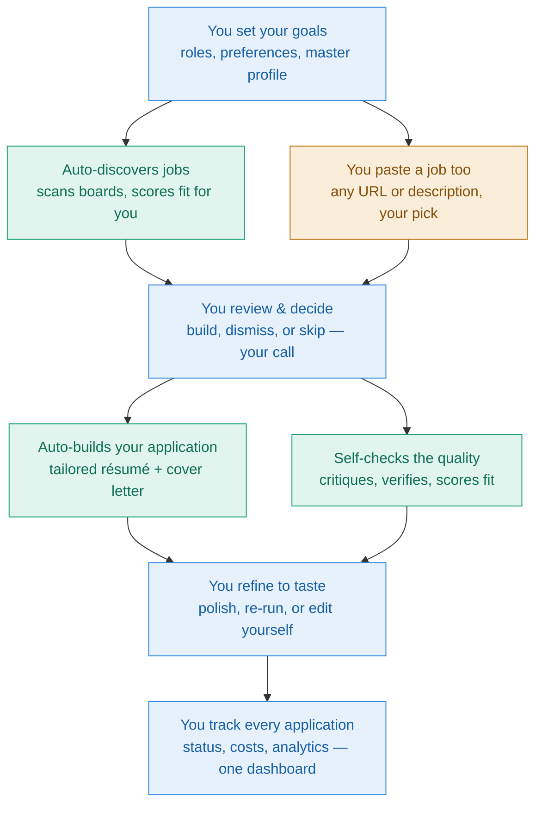

# Maestro AI

**An open-source, AI-powered job-search automation system.**

*Decode. Decide. Deliver.* — A product of Parseus AI

---

Maestro AI automatically discovers jobs that match you, scores them for fit, drafts tailored résumés and cover letters, lets you review and refine everything from a clean dashboard, and tracks every application end to end.

## What problem it solves

Applying for jobs is repetitive and slow — and the usual shortcuts make it worse. Paste your résumé into a chatbot for every posting and you redo the same work each time, with no memory of what you've applied to and no one checking the output for invented skills. Use a one-click auto-apply bot and you blast out generic, templated résumés that recruiters increasingly reject. Either way you get the same problems:

- **Generic, templated output** that reads like every other applicant's.
- **No fact-checking** — AI invents skills and numbers, and you're the only one catching them.
- **No memory or tracking** — nothing carries a structured record of where you applied, at what cost.
- **The tool decides, or you do everything by hand** — there's no middle ground that keeps you in control without drowning in manual work.

Maestro closes these gaps: it runs a real pipeline of specialized agents that draft, critique, and fact-check your application, builds everything from a master profile you curate, tracks every run, and leaves the apply decision to you.

## Why it matters now

Generic AI résumés don't just underperform — they're now actively screened out, and there's a second, less obvious trap underneath.

Recruiters report reviewing batches of résumés that feel interchangeable: identical summaries, the same action verbs, suspiciously clean formatting. When everyone uses the same tool with one fixed model and a locked prompt, output converges — and a résumé that reads too perfectly becomes a red flag. Vendor surveys put real numbers on it (a Resume Now survey of 925 HR workers found 62% reject AI résumés that lack personalization).

The deeper trap is technical. A 2026 peer-reviewed study ([arXiv 2509.00462](https://arxiv.org/abs/2509.00462)) found that LLM résumé screeners prefer résumés written by *the same model* — a self-preference bias of 67–82% — and that candidates using the same model as the screener were **23–60% more likely to be shortlisted**, even when quality was equal. If every applicant's tool writes with one default model, sameness compounds.

Maestro is built to break both: you vary the model per agent and tune each prompt to your own voice, so your résumé reads like *you* — and the experience keeps you deciding at every step:

Blue steps are yours; teal steps run automatically; amber is where you hand it a job to work on.

## How is the experience with Maestro AI?

In short: it does the heavy lifting, you make the calls. A few things set it apart from the alternatives — covered in full on the **[Why Maestro AI?](why-maestro.md)** page, summarized here:

- **How Maestro compares** — versus chatbots, volume auto-appliers, trackers, and résumé optimizers, Maestro is the only option that finds *and* scores jobs, fact-checks with a Verifier agent, self-critiques with a Critic agent, runs unattended, keeps your data local, and leaves the apply decision to you.
- **You choose which model runs each agent** — cheap models for high-volume scoring, premium models for building and refining. The dashboard shows what every choice cost.
- **Two axes of control** — *which model* runs each agent, and *how it behaves* (an editable prompt tuned to your voice). The agents build the case; you make the final call.
- **Memory you control** — instead of opaque chatbot memory that blends in context you can't see, Maestro builds from one master profile you curate, with nothing carrying over that you didn't choose.
- **The bottom line** — systematic, self-checking, controllable, human-decided, and open source.

See the **[full comparison, diagrams, and evidence →](why-maestro.md)**

## Find your way around

-   :material-rocket-launch: **Getting started**

    ---

    [Overview](01-overview.md) · [Installation](02-installation.md) · [Configuration](03-configuration.md) · [Running the system](04-running.md)

-   :material-book-open-variant: **Reference**

    ---

    [Architecture](05-architecture.md) · [Database reference](06-database-reference.md) · [Importing workflows](11-importing-workflows.md) · [Troubleshooting](07-troubleshooting.md)

-   :material-tune: **Customizing**

    ---

    [Prompting & customizing the agents](09-prompting.md) · [Your master career dossier](10-master-dossier.md)

-   :material-help-circle: **Quick answers**

    ---

    [FAQ & glossary](08-faq-glossary.md)

## What you'll need

- A computer running Windows, macOS, or Linux
- [Docker Desktop](https://www.docker.com/products/docker-desktop/) and [Node.js 20](https://nodejs.org)
- A Google account (a dedicated one is recommended)
- At least one AI provider API key (Anthropic recommended)

First-time setup takes 45–90 minutes, most of it Google account configuration.
