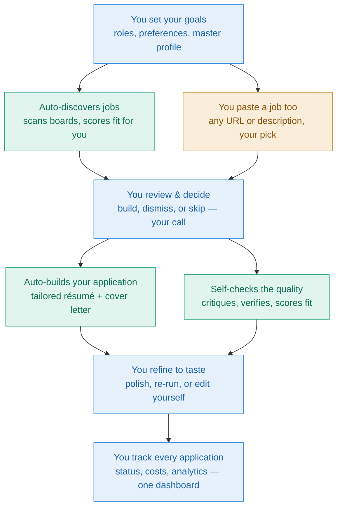

# Maestro AI

**An open-source, AI-powered job-search automation system.**

*Decode. Decide. Deliver.* — A product of Parseus AI

---

Maestro AI automatically discovers jobs that match you, scores them for fit, drafts tailored résumés and cover letters, lets you review and refine everything from a clean dashboard, and tracks every application end to end.

## What problem it solves

Applying for jobs is repetitive and slow — and the usual shortcuts make it worse. Paste your résumé into a chatbot for every posting and you redo the same work each time, with no memory of what you've applied to and no one checking the output for invented skills. Use a one-click auto-apply bot and you blast out generic, templated résumés that recruiters increasingly reject. Either way you get the same problems:

- **Generic, templated output** that reads like every other applicant's.
- **No fact-checking** — AI invents skills and numbers, and you're the only one catching them.
- **No memory or tracking** — nothing carries a structured record of where you applied, at what cost.
- **The tool decides, or you do everything by hand** — there's no middle ground that keeps you in control without drowning in manual work.

Maestro closes these gaps: it runs a real pipeline of specialized agents that draft, critique, and fact-check your application, builds everything from a master profile you curate, tracks every run, and leaves the apply decision to you.

## Why it matters now

Generic AI résumés don't just underperform — they're now actively screened out, and there's a second, less obvious trap underneath.

Recruiters report reviewing batches of résumés that feel interchangeable: identical summaries, the same action verbs, suspiciously clean formatting. When everyone uses the same tool with one fixed model and a locked prompt, output converges — and a résumé that reads too perfectly becomes a red flag. Vendor surveys put real numbers on it (a Resume Now survey of 925 HR workers found 62% reject AI résumés that lack personalization).

The deeper trap is technical. A 2026 peer-reviewed study ([arXiv 2509.00462](https://arxiv.org/abs/2509.00462)) found that LLM résumé screeners prefer résumés written by *the same model* — a self-preference bias of 67–82% — and that candidates using the same model as the screener were **23–60% more likely to be shortlisted**, even when quality was equal. If every applicant's tool writes with one default model, sameness compounds.

Maestro is built to break both: you vary the model per agent and tune each prompt to your own voice, so your résumé reads like *you* — not like a tool's default that recruiters and screeners have learned to discount.

## How is the experience with Maestro AI?

From your side, Maestro is a loop where the automation does the heavy lifting and you make every real decision. You set your goals once, it discovers and scores jobs (or you paste one in), you decide what's worth pursuing, it builds and self-checks the application, you refine to taste, and everything is tracked in one place.

Blue steps are yours; teal steps run automatically; amber is where you hand it a job to work on.

What makes that experience different from the alternatives comes down to a few ideas:

**It checks its own work.** Most tools hand you a draft and trust you to catch the problems. Maestro runs a Verifier agent that fact-checks every claim against your real history (so it can't invent a skill or a number), and a Critic agent that flags weak or generic writing — before you ever see the result. Checking isn't a step you have to remember; it's built into the pipeline.

**You pick the right model for each job, not one model for everything.** Scoring hundreds of jobs is cheap, low-stakes work; writing your résumé is expensive, high-stakes work. Maestro lets you assign a cheap fast model to the first and a premium model to the second, so you spend where it counts and the dashboard shows exactly what each run cost. No other tool in this space gives you that lever — most lock you into one model and one price.

**You control how each agent behaves.** Beyond *which* model runs a step, you can edit the actual prompt that drives it — tuning it to your background and voice, then resetting to the default whenever you want. That's the difference between output that sounds like a tool and output that sounds like you.

**Your context is something you can see and control.** Chatbot "memory" quietly blends in things you can't inspect — old drafts, roles you skipped, a salary aside from three chats ago — and that hidden context leaks into every future résumé. Maestro is the opposite: it builds from one master profile you curate, plus the specific job at hand, and nothing else carries over. Same inputs produce the same output, every time, with no contamination you didn't choose.

**You make the final call.** Maestro never applies for you. It discovers, drafts, critiques, verifies, and scores — it builds the case — but the decision to apply is always yours. And because it's open source and self-hosted, it runs on your machine with your own API keys; your résumé and history never sit on someone else's server.

For the full side-by-side comparison, the per-agent model and control diagrams, and the research behind the sameness problem, see **[Why Maestro AI? →](why-maestro.md)**

## Find your way around

-   :material-rocket-launch: **Getting started**

    ---

    [Overview](01-overview.md) · [Installation](02-installation.md) · [Configuration](03-configuration.md) · [Running the system](04-running.md)

-   :material-book-open-variant: **Reference**

    ---

    [Architecture](05-architecture.md) · [Database reference](06-database-reference.md) · [Importing workflows](11-importing-workflows.md) · [Troubleshooting](07-troubleshooting.md)

-   :material-tune: **Customizing**

    ---

    [Prompting & customizing the agents](09-prompting.md) · [Your master career dossier](10-master-dossier.md)

-   :material-help-circle: **Quick answers**

    ---

    [FAQ & glossary](08-faq-glossary.md)

## What you'll need

- A computer running Windows, macOS, or Linux
- [Docker Desktop](https://www.docker.com/products/docker-desktop/) and [Node.js 20](https://nodejs.org)
- A Google account (a dedicated one is recommended)
- At least one AI provider API key (Anthropic, OpenAI, or Gemini)

First-time setup takes 45–90 minutes, most of it Google account configuration.
